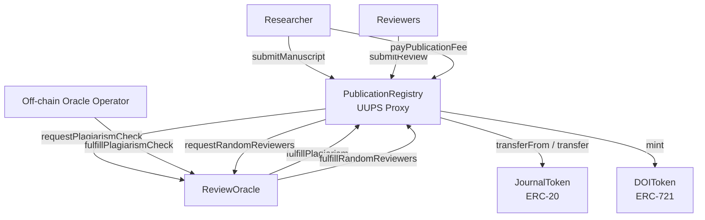
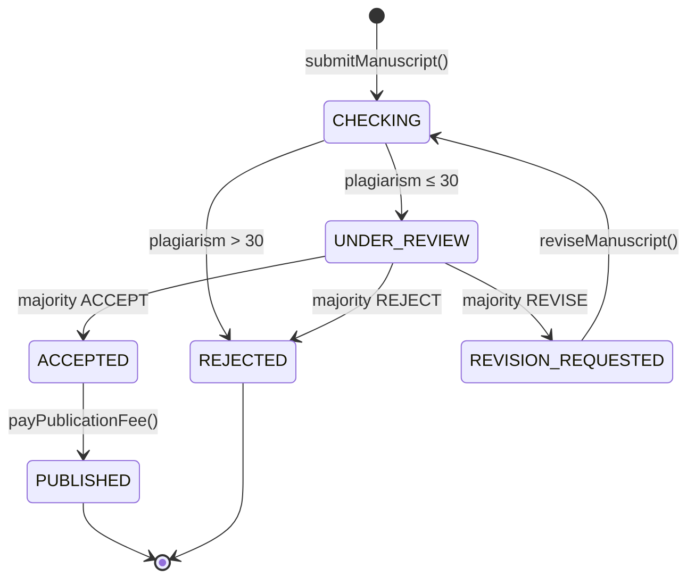
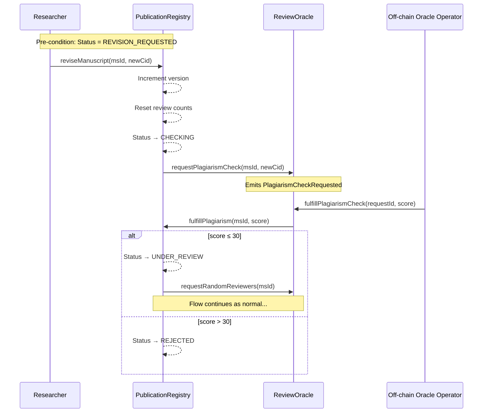
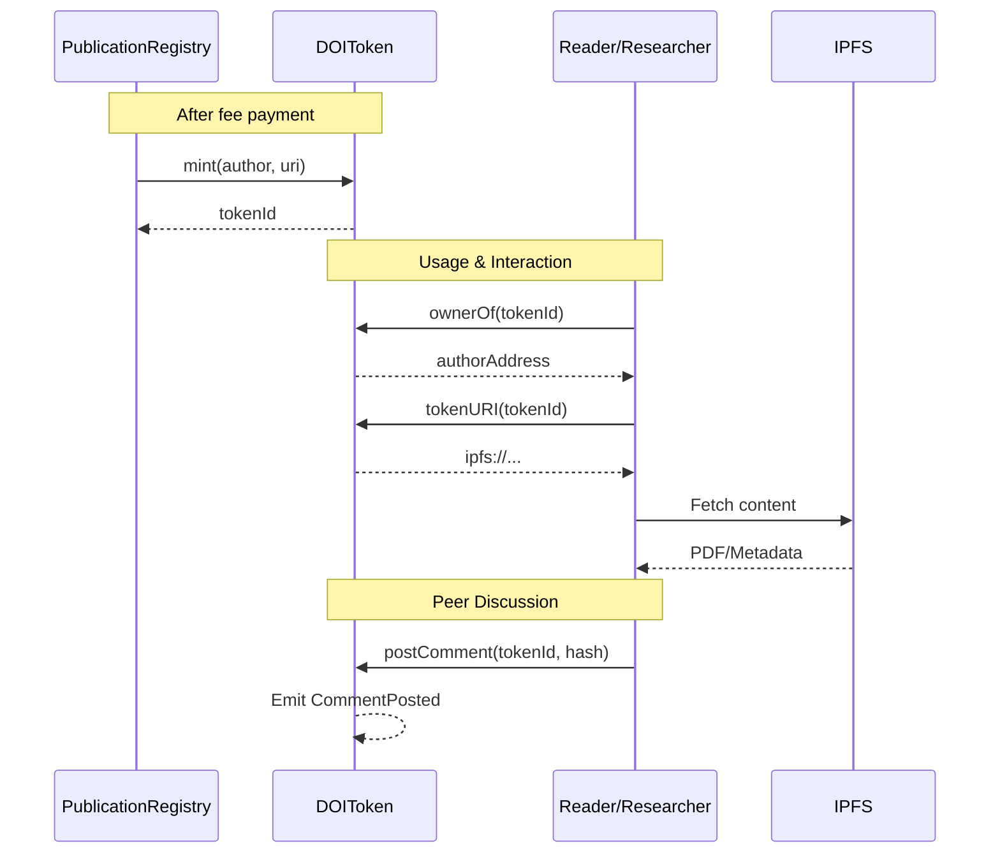

### Contract Interaction Diagram

```mermaid
sequenceDiagram
    participant R as Researcher
    participant PR as PublicationRegistry
    participant RO as ReviewOracle
    participant OO as Off-chain Oracle Operator
    participant JT as JournalToken
    participant DOI as DOIToken
    participant Rev as Reviewers

    R->>PR: submitManuscript(cid, metadata)
    PR->>RO: requestPlagiarismCheck(msId, cid)
    Note over RO: Emits PlagiarismCheckRequested
    
    OO->>RO: fulfillPlagiarismCheck(requestId, score)
    RO->>PR: fulfillPlagiarism(msId, score)
    
    alt score ≤ threshold
        PR->>RO: requestRandomReviewers(msId)
        Note over RO: Selects via block.prevrandao
        RO->>PR: fulfillRandomReviewers(msId, reviewers[])
        
        loop Each Reviewer (3x)
            Rev->>PR: submitReview(msId, hash, verdict)
        end
        
        alt Majority ACCEPT
            PR-->>PR: Status → ACCEPTED
            R->>JT: approve(registry, fee)
            R->>PR: payPublicationFee(msId)
            PR->>JT: transferFrom(author, registry, fee)
            PR->>JT: transfer(reviewer, incentive) × 3
            PR->>DOI: mint(author, tokenId, uri)
            PR-->>PR: Status → PUBLISHED
        else Majority REVISE
            PR-->>PR: Status → REVISION_REQUESTED
            R->>PR: reviseManuscript(msId, newCid)
            Note over PR: Re-enters CHECKING state
        else Majority REJECT
            PR-->>PR: Status → REJECTED
        endz
    else score > threshold
        PR-->>PR: Status → REJECTED
    end
```

## Architecture



## State Machine



## Manuscript Revision Flow



## DOI Token Usage

