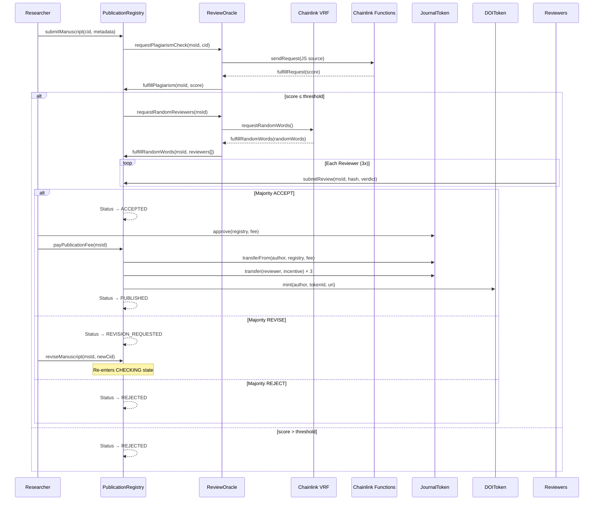

# Decentralized Publication System — Smart Contract Suite

A suite of 4 interacting Solidity smart contracts implementing a full manuscript lifecycle with Chainlink oracle integration, deployed on Polygon Amoy Testnet (Chain ID 80002).

## User Review Required

> [!IMPORTANT]
> **Chainlink "Any-API" is deprecated.** The user's spec requests `ReviewOracle` use Chainlink Any-API for plagiarism checks. Chainlink has deprecated the legacy Direct Request (Any-API) model and replaced it with **Chainlink Functions**. This plan uses **Chainlink Functions** on Polygon Amoy (`Router: 0xC22a79eBA640940ABB6dF0f7982cc119578E11De`, `DON ID: fun-polygon-amoy-1`) for the plagiarism check, which is the modern equivalent and fully supported on Amoy.

> [!WARNING]
> **VRF Subscription required.** Chainlink VRF v2.5 requires a funded subscription created via [vrf.chain.link](https://vrf.chain.link). The subscription ID must be provided as a constructor parameter during deployment. The `ReviewOracle` contract address must be added as a consumer on the subscription.

> [!IMPORTANT]
> **Plagiarism API endpoint.** The Chainlink Functions JavaScript source code needs a real plagiarism-check API endpoint. The plan includes a placeholder URL (`https://api.example.com/plagiarism?cid=`). You will need to provide the actual API endpoint and any required secrets.

## Open Questions

1. **Publication fee amount**: What should the JournalToken fee be for publishing? (default: `100 * 10^18` = 100 JRT)
2. **Reviewer incentive amount**: How much JournalToken should each reviewer receive? (default: `10 * 10^18` = 10 JRT per reviewer)
3. **Plagiarism threshold**: What score (0-100) should be the cutoff? (default: `30` — scores > 30 are rejected)
4. **Reviewer pool management**: Should the admin register reviewer addresses upfront via `addReviewer()`, or should any address with `REVIEWER_ROLE` be eligible? (default: explicit `reviewerPool` array maintained by admin)
5. **Number of reviewers per manuscript**: Always 3, or random 2-3 via VRF? (default: always 3, using VRF only for *which* reviewers)

---

## Proposed Changes

### Project Setup & Configuration

#### [MODIFY] [hardhat.config.js](file:///home/archlinux/Desktop/Kuliah/TA/proj/smartcontract/hardhat.config.js)

Configure Hardhat with:
- Solidity `0.8.24` compiler (stable, 0.8.20+ as required)
- `evmVersion: "paris"` — Polygon Amoy may not support the `PUSH0` opcode from Shanghai
- Polygon Amoy network config (Chain ID `80002`, RPC: `https://rpc-amoy.polygon.technology/`)
- `@openzeppelin/hardhat-upgrades` plugin for UUPS proxy deployment
- `@nomicfoundation/hardhat-verify` for Polygonscan verification

#### [MODIFY] [package.json](file:///home/archlinux/Desktop/Kuliah/TA/proj/smartcontract/package.json)

Dependencies:
```
@openzeppelin/contracts           ^5.1.0
@openzeppelin/contracts-upgradeable ^5.1.0
@chainlink/contracts               ^1.3.0
hardhat                            ^2.22.0
@nomicfoundation/hardhat-toolbox   ^5.0.0
@openzeppelin/hardhat-upgrades     ^3.6.0
dotenv                             ^16.4.0
```

#### [MODIFY] [.env.example](file:///home/archlinux/Desktop/Kuliah/TA/proj/smartcontract/.env.example)

Environment variables:
```
PRIVATE_KEY=
POLYGONSCAN_API_KEY=
AMOY_RPC_URL=https://rpc-amoy.polygon.technology/
VRF_SUBSCRIPTION_ID=
FUNCTIONS_SUBSCRIPTION_ID=
```

---

### Smart Contract: JournalToken (ERC-20)

#### [NEW] [JournalToken.sol](file:///home/archlinux/Desktop/Kuliah/TA/proj/smartcontract/contracts/JournalToken.sol)

Simple ERC-20 token with `AccessControl`:
- **Role**: `MINTER_ROLE` — only admin can mint initial supply and additional tokens
- Constructor: `name = "JournalToken"`, `symbol = "JRT"`, initial supply minted to deployer
- Standard ERC-20 (non-upgradeable — token contracts are typically immutable)
- Inherits: `ERC20`, `AccessControl` from OpenZeppelin 5.x

---

### Smart Contract: DOIToken (ERC-721)

#### [NEW] [DOIToken.sol](file:///home/archlinux/Desktop/Kuliah/TA/proj/smartcontract/contracts/DOIToken.sol)

ERC-721 NFT representing a published article:
- **Role**: `MINTER_ROLE` — restricted to `PublicationRegistry` contract address only
- `mint(address to, uint256 tokenId, string memory tokenURI_)` — mints NFT with IPFS metadata URI
- Inherits: `ERC721`, `ERC721URIStorage`, `AccessControl` from OpenZeppelin 5.x
- Stores DOI metadata pointing to IPFS via `tokenURI`
- Event: `CommentPosted(uint256 indexed doiId, address indexed reader, bytes32 hash)` — for reader comments on published articles

---

### Smart Contract: ReviewOracle (Chainlink VRF v2.5 + Functions)

#### [NEW] [ReviewOracle.sol](file:///home/archlinux/Desktop/Kuliah/TA/proj/smartcontract/contracts/ReviewOracle.sol)

Oracle interface contract with two Chainlink integrations:

**Chainlink VRF v2.5 (Random Reviewer Assignment):**
- Inherits: `VRFConsumerBaseV2Plus`
- Polygon Amoy VRF Coordinator: `0x343300b5d84D444B2ADc9116FEF1bED02BE49Cf2`
- Key Hash: `0x816bedba8a50b294e5cbd47842baf240c2385f2eaf719edbd4f250a137a8c899`
- `requestRandomReviewers(uint256 msId)` → calls `s_vrfCoordinator.requestRandomWords(...)`
- `fulfillRandomWords(uint256 requestId, uint256[] calldata randomWords)` → selects 3 reviewers from pool using modular arithmetic, calls back to `PublicationRegistry`

**Chainlink Functions (Plagiarism Check):**
- Inherits: `FunctionsClient`
- Polygon Amoy Functions Router: `0xC22a79eBA640940ABB6dF0f7982cc119578E11De`
- DON ID: `fun-polygon-amoy-1`
- `requestPlagiarismCheck(uint256 msId, string memory cid)` → sends JS source to Chainlink Functions that calls the plagiarism API
- `fulfillRequest(bytes32 requestId, bytes memory response, bytes memory err)` → decodes score, calls back to `PublicationRegistry.fulfillPlagiarism()`

**Access Control:**
- Only `PublicationRegistry` can call `requestRandomReviewers()` and `requestPlagiarismCheck()`
- Stores mapping `requestId → msId` for both VRF and Functions

**State:**
```solidity
mapping(uint256 => uint256) public vrfRequestToMs;    // VRF requestId → msId
mapping(bytes32 => uint256) public funcRequestToMs;   // Functions requestId → msId
address public publicationRegistry;
address[] public reviewerPool;
```

---

### Smart Contract: PublicationRegistry (UUPS Upgradeable)

#### [NEW] [PublicationRegistry.sol](file:///home/archlinux/Desktop/Kuliah/TA/proj/smartcontract/contracts/PublicationRegistry.sol)

Core state machine and controller contract:

**Inheritance:**
- `Initializable`, `UUPSUpgradeable`, `AccessControlUpgradeable` from OpenZeppelin 5.x upgradeable

**Roles:**
```solidity
bytes32 public constant RESEARCHER_ROLE = keccak256("RESEARCHER_ROLE");
bytes32 public constant REVIEWER_ROLE   = keccak256("REVIEWER_ROLE");
bytes32 public constant ADMIN_ROLE      = keccak256("ADMIN_ROLE");
```

**State Machine — Manuscript States:**
```solidity
enum Status {
    SUBMITTED,          // 0
    CHECKING,           // 1
    UNDER_REVIEW,       // 2
    REVISION_REQUESTED, // 3
    ACCEPTED,           // 4
    REJECTED,           // 5
    PUBLISHED           // 6
}
```

**Manuscript Struct:**
```solidity
struct Manuscript {
    uint256 id;
    address author;
    string cid;              // IPFS CID
    string metadata;         // JSON metadata string
    Status status;
    uint256 version;
    uint256 plagiarismScore;
    address[] reviewers;
    uint256 acceptCount;
    uint256 rejectCount;
    uint256 reviseCount;
    uint256 reviewCount;     // total reviews submitted
    mapping(address => bool) hasReviewed;
}
```

**Core Functions:**

| Function | Access | State Transition | Description |
|---|---|---|---|
| `initialize(doiToken, journalToken, reviewOracle)` | deployer | — | UUPS initializer, sets up roles and contract references |
| `submitManuscript(cid, metadata)` | `RESEARCHER_ROLE` | → SUBMITTED → CHECKING | Creates record, auto-calls `reviewOracle.requestPlagiarismCheck()` |
| `fulfillPlagiarism(msId, score)` | `ReviewOracle` only | CHECKING → UNDER_REVIEW / REJECTED | If score ≤ threshold → VRF call; else → REJECTED |
| `fulfillRandomWords(msId, reviewers)` | `ReviewOracle` only | (sets reviewers on UNDER_REVIEW ms) | Assigns reviewer addresses to manuscript |
| `submitReview(msId, hash, verdict)` | assigned `REVIEWER_ROLE` | UNDER_REVIEW → ACCEPTED / REJECTED / REVISION_REQUESTED | Verdict enum: ACCEPT, REJECT, REVISE. Majority decision after N reviews |
| `reviseManuscript(msId, newCid)` | original author | REVISION_REQUESTED → CHECKING | Increments version, re-triggers plagiarism check |
| `payPublicationFee(msId)` | original author | ACCEPTED → PUBLISHED | Transfers JRT fee, mints DOI NFT, distributes reviewer incentives |
| `_authorizeUpgrade(address)` | `ADMIN_ROLE` | — | UUPS upgrade authorization |

**Custom Errors:**
```solidity
error InvalidState(uint256 msId, Status expected, Status actual);
error NotAuthor(uint256 msId, address caller);
error NotAssignedReviewer(uint256 msId, address caller);
error AlreadyReviewed(uint256 msId, address reviewer);
error InsufficientAllowance(uint256 required, uint256 actual);
error PlagiarismThresholdExceeded(uint256 msId, uint256 score);
error ManuscriptNotFound(uint256 msId);
```

**Events:**
```solidity
event ManuscriptSubmitted(uint256 indexed msId, string cid);
event DecisionMade(uint256 indexed msId, Status decision);
event IncentivePaid(address indexed reviewer, uint256 amount);
event CommentPosted(uint256 indexed doiId, address indexed reader, bytes32 hash);
```

**Decision Logic:**
```
Given 3 reviewers:
- 2+ ACCEPT → Status.ACCEPTED
- 2+ REJECT → Status.REJECTED
- 2+ REVISE → Status.REVISION_REQUESTED
- Mixed (1 each) → Status.REVISION_REQUESTED (conservative default)
```

---

### Deployment Script

#### [NEW] [deploy.js](file:///home/archlinux/Desktop/Kuliah/TA/proj/smartcontract/scripts/deploy.js)

Deployment order (dependency-aware):
1. Deploy `JournalToken` → mint initial supply to deployer
2. Deploy `DOIToken`
3. Deploy `ReviewOracle` (with VRF coordinator, subscription ID, key hash, Functions router)
4. Deploy `PublicationRegistry` via UUPS proxy (`upgrades.deployProxy(...)`)
5. **Post-deployment configuration:**
   - Grant `MINTER_ROLE` on `DOIToken` to `PublicationRegistry` address
   - Set `PublicationRegistry` address on `ReviewOracle`
   - Grant appropriate roles to admin wallet

#### [NEW] [upgrade.js](file:///home/archlinux/Desktop/Kuliah/TA/proj/smartcontract/scripts/upgrade.js)

Script for upgrading `PublicationRegistry` via `upgrades.upgradeProxy()`.

---

### Contract Interaction Diagram



---

## File Structure

```
smartcontract/
├── contracts/
│   ├── PublicationRegistry.sol    # UUPS upgradeable state machine
│   ├── DOIToken.sol               # ERC-721 NFT
│   ├── JournalToken.sol           # ERC-20 utility token
│   └── ReviewOracle.sol           # Chainlink VRF v2.5 + Functions
├── scripts/
│   ├── deploy.js                  # Full deployment script
│   └── upgrade.js                 # UUPS upgrade script
├── test/
│   └── PublicationSystem.test.js  # Integration tests with mocks
├── hardhat.config.js
├── package.json
├── .env.example
└── .gitignore
```

---

## Verification Plan

### Automated Tests
1. **Compile**: `npx hardhat compile` — ensures all contracts compile without errors
2. **Unit tests**: `npx hardhat test` — tests covering:
   - Full lifecycle: SUBMITTED → CHECKING → UNDER_REVIEW → ACCEPTED → PUBLISHED
   - Rejection path: plagiarism threshold exceeded
   - Revision path: majority REVISE → resubmit → re-check
   - Access control: unauthorized calls revert
   - Custom error validation
3. **Deployment dry-run**: `npx hardhat run scripts/deploy.js` on local Hardhat network

### Manual Verification
- Deploy to Polygon Amoy testnet and verify contracts on [amoy.polygonscan.com](https://amoy.polygonscan.com)
- Fund VRF subscription and add `ReviewOracle` as consumer
- Fund Chainlink Functions subscription
- End-to-end flow test on testnet
