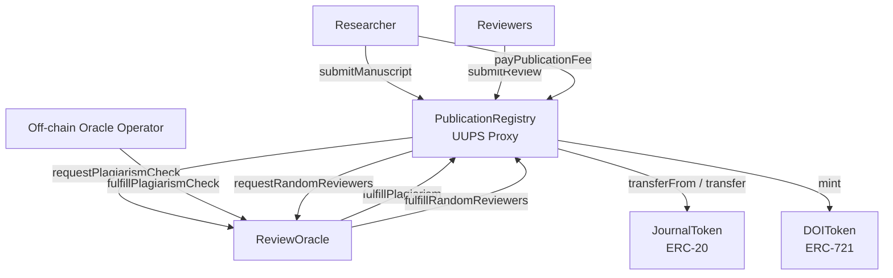
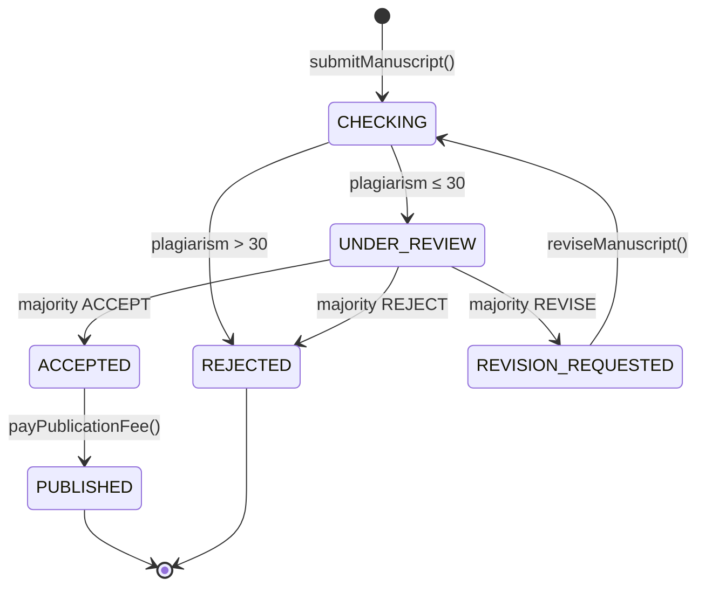

# Decentralized Publication System — Walkthrough

## Summary

Built a complete suite of 4 interacting Solidity smart contracts for a decentralized academic publication system targeting **Ethereum Sepolia Testnet** (Chain ID 11155111). All 59 Solidity files compile cleanly and **25 integration tests pass**.

---

## Files Created

### Configuration
| File | Purpose |
|------|---------|
| [package.json](file:///home/archlinux/Desktop/Kuliah/TA/proj/smartcontract/package.json) | Dependencies: OZ 5.1, Hardhat 2.22 |
| [hardhat.config.js](file:///home/archlinux/Desktop/Kuliah/TA/proj/smartcontract/hardhat.config.js) | Solidity 0.8.24, Cancun EVM, Sepolia network |
| [.env.example](file:///home/archlinux/Desktop/Kuliah/TA/proj/smartcontract/.env.example) | Template for private key and RPC URL |
| [.gitignore](file:///home/archlinux/Desktop/Kuliah/TA/proj/smartcontract/.gitignore) | Excludes node_modules, artifacts, .env |

### Smart Contracts
| Contract | File | Standard | Role |
|----------|------|----------|------|
| **JournalToken** | [JournalToken.sol](file:///home/archlinux/Desktop/Kuliah/TA/proj/smartcontract/contracts/JournalToken.sol) | ERC-20 + AccessControl | Publication fees & reviewer incentives |
| **DOIToken** | [DOIToken.sol](file:///home/archlinux/Desktop/Kuliah/TA/proj/smartcontract/contracts/DOIToken.sol) | ERC-721 + ERC721URIStorage + AccessControl | NFT representing published article |
| **ReviewOracle** | [ReviewOracle.sol](file:///home/archlinux/Desktop/Kuliah/TA/proj/smartcontract/contracts/ReviewOracle.sol) | AccessControl | Custom oracle for plagiarism & reviewers |
| **PublicationRegistry** | [PublicationRegistry.sol](file:///home/archlinux/Desktop/Kuliah/TA/proj/smartcontract/contracts/PublicationRegistry.sol) | UUPS Upgradeable + AccessControlUpgradeable | Core state machine & controller |

### Scripts
| File | Purpose |
|------|---------|
| [deploy.js](file:///home/archlinux/Desktop/Kuliah/TA/proj/smartcontract/scripts/deploy.js) | Full dependency-aware deployment + post-deploy role config |
| [upgrade.js](file:///home/archlinux/Desktop/Kuliah/TA/proj/smartcontract/scripts/upgrade.js) | UUPS proxy upgrade for PublicationRegistry |

### Tests
| File | Purpose |
|------|---------|
| [PublicationSystem.test.js](file:///home/archlinux/Desktop/Kuliah/TA/proj/smartcontract/test/PublicationSystem.test.js) | 25 integration tests |
| [MockReviewOracle.sol](file:///home/archlinux/Desktop/Kuliah/TA/proj/smartcontract/contracts/mocks/MockReviewOracle.sol) | No-op oracle mock for testing |

---

## Architecture



## State Machine



## Roles & Access Control

| Role | Granted To | Can Do |
|------|-----------|--------|
| `DEFAULT_ADMIN_ROLE` | Deployer | Manage all roles |
| `ADMIN_ROLE` | Admin | Upgrade proxy, grant roles, configure |
| `RESEARCHER_ROLE` | Researchers | Submit/revise manuscripts, pay fees |
| `REVIEWER_ROLE` | Reviewers | Submit reviews |
| `ORACLE_ROLE` | Oracle Operator | Call fulfillPlagiarismCheck |
| `MINTER_ROLE` (DOIToken) | PublicationRegistry | Mint DOI NFTs |
| `MINTER_ROLE` (JournalToken) | Admin | Mint JRT tokens |
| `REGISTRY_ROLE` (ReviewOracle) | PublicationRegistry | Request oracle services |


## Test Results

```
  Publication System
    Deployment
      ✔ should deploy JournalToken with correct initial supply
      ✔ should deploy DOIToken with MINTER_ROLE granted to registry
      ✔ should deploy PublicationRegistry as UUPS proxy
      ✔ should have correct roles assigned
    Manuscript Submission
      ✔ should revert if caller lacks RESEARCHER_ROLE
    Full Lifecycle — Accept Path
      ✔ should handle plagiarism check fulfillment — pass
    State Machine — Direct Oracle Simulation
      ✔ should submit manuscript and enter CHECKING state
      ✔ should transition CHECKING → UNDER_REVIEW on plagiarism pass
      ✔ should transition CHECKING → REJECTED on plagiarism fail
      ✔ should assign reviewers via fulfillRandomReviewers
      ✔ should handle review submission and majority ACCEPT
      ✔ should handle majority REJECT
      ✔ should handle majority REVISE
      ✔ should prevent double review
      ✔ should prevent non-assigned reviewer from submitting
      ✔ should handle revise → resubmit flow
      ✔ should handle full publication flow with fee payment
      ✔ should revert payPublicationFee without sufficient allowance
      ✔ should revert if non-author tries to pay fee
    DOIToken
      ✔ should allow posting comments on existing DOI
      ✔ should revert comment on non-existent DOI
    JournalToken
      ✔ should mint tokens only with MINTER_ROLE
      ✔ should allow admin to mint additional tokens
      ✔ should revert minting zero amount
    Access Control
      ✔ should prevent unauthorized UUPS upgrade

  25 passing (3s)
```

## Design Decisions & Notes

1. **Custom Oracle System**: Replaced Chainlink VRF and Functions with a custom oracle. Plagiarism checks are now fulfilled by an off-chain operator (`ORACLE_ROLE`), and reviewer selection uses on-chain pseudo-randomness (`block.prevrandao`), which is efficient and suitable for this testnet environment.

2. **Cancun EVM**: OpenZeppelin 5.1.0 uses the `mcopy` opcode in `Bytes.sol`, which requires the Cancun EVM version. Ethereum Sepolia supports this.

3. **Error Naming**: Maintained `OracleZeroAddress` for clarity in the custom oracle contract.

4. **State skip**: `submitManuscript()` transitions directly from creation to `CHECKING` (skipping `SUBMITTED` as a distinct persisted state) since the plagiarism check is triggered automatically.

5. **Publication fee flow**: The author must first `approve()` JRT to the registry, then call `payPublicationFee()`. The registry deducts the fee and distributes reviewer incentives (10 JRT each × 3 reviewers = 30 JRT to reviewers, 70 JRT retained by registry).

## Next Steps for Testnet Deployment

1. Copy `.env.example` → `.env` and fill in `PRIVATE_KEY`.
2. Get ETH from [faucets.chain.link](https://faucets.chain.link).
3. Run: `npx hardhat run scripts/deploy.js --network sepolia`.
4. Add reviewer addresses via `ReviewOracle.addReviewer()`.
5. Grant `REVIEWER_ROLE` on `PublicationRegistry` to authorized reviewers.
6. Grant `ORACLE_ROLE` on `ReviewOracle` to your off-chain oracle operator address.
7. Set up an off-chain script to listen for `PlagiarismCheckRequested` events and respond via `fulfillPlagiarismCheck`.
